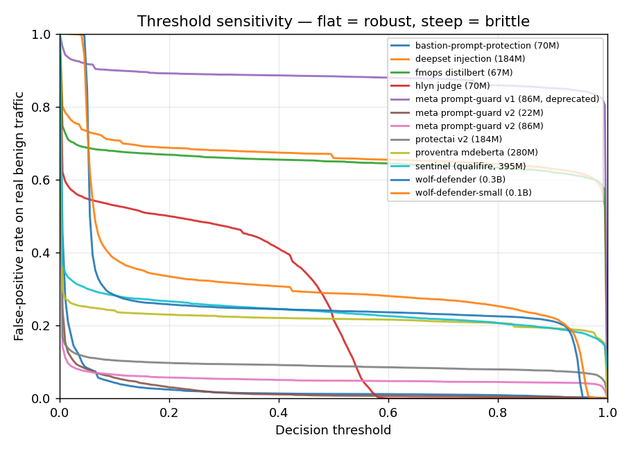
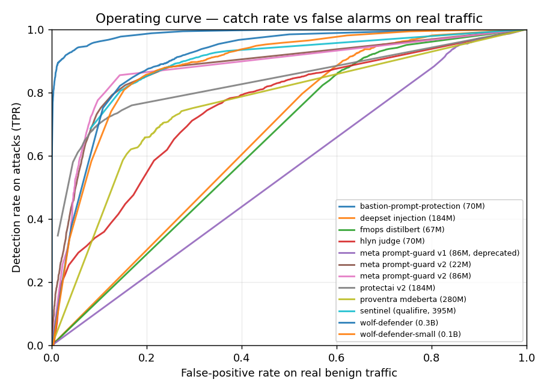
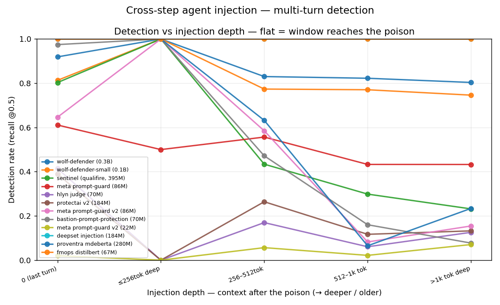

# Reading the results — an honest verdict

This is the interpretation layer for the raw numbers in this folder: *what they
mean across the evaluated detectors, and where even the strongest performers are
weak.* The tables are the evidence; this is the argument. Every number here is
reproducible from the committed per-prompt scores (`scores/`, `scores_indirect/`)
with no GPU — see [METHODOLOGY.md](../METHODOLOGY.md) and [CONTRIBUTING.md](../CONTRIBUTING.md).

> **Disclosure.** This benchmark is maintained by **Bastion Soft**, who also ship one of
> the evaluated detectors (`bastion-prompt-protection`). Every number is reproducible from
> the committed raw scores, every detector is scored through the identical generic path, and
> this document is explicit about where each model — **including Bastion's own** — is weak.
> Be skeptical, and rerun it.

---

## TL;DR

- **Detection:** Bastion leads average ROC-AUC (**0.991**) and F1@0.5 (**0.943**) across the four held-out adversarial benchmarks — ahead of detectors 4–6× its size. It does **not** win every column (sentinel beats it on `rogue`; wolf-defender on `xTRam1` F1).
- **False positives on real traffic:** **1.24%** at the default threshold — lowest of every detector measured, by a wide margin. This is the axis that breaks detectors in production.
- **The fair, threshold-agnostic comparison** (hold catch-rate constant, compare false alarms): forcing every detector to catch 95% of attacks, Bastion flags **7.71%** of real benign traffic vs the next-best **34.63%**. The "you only win because of where 0.5 falls" objection does not survive this.
- **Indirect / structured injection:** Bastion leads average AUC (**0.952** vs next-best 0.865) **and** the within-set false-alarm rate (**16.59%** vs 45.78%) — but it has **real weak spots** (BIPIA, AgentDojo; see below).
- **Multi-turn / cross-step:** Bastion leads conversational jailbreak (AUC **0.795**) and nails *recent* cross-step injections, but its **512-token window** is a real weakness on *deeply-buried* cross-step attacks (recall falls to **0.08**) — where long-context detectors (wolf-defender, 8k) hold up. Detection only reaches as far as the window (§6).
- **What no classifier here can do:** catch domain-specific abuse or tool misuse. A detector is one layer, not the whole defense.

---

## How to read these numbers

A detector outputs a 0–1 risk score per prompt; you pick a **threshold** (line) above which you block. Three families of metric, measuring different things:

- **ROC-AUC** — *threshold-free.* How well the detector **ranks** attacks above benign across every possible line. The "how good is it really" number; can't be gamed by threshold choice.
- **F1 / FPR at a fixed threshold (0.5)** — *operating-point.* How it behaves **out of the box** if you don't tune. Realistic (most people never tune), but unfair to detectors whose scores happen to cluster near 0.5.
- **FPR at a fixed detection rate / EER** — *threshold-agnostic, fair.* Tune each detector to the **same catch rate**, then compare the false-alarm cost. Removes the "where's the line" objection entirely.

Two reading rules used throughout: **averages are unweighted** (JailbreakBench, n=200, counts as much as rogue, n=5,000 — read the per-column numbers), and **small sets are noisy** (JBB especially).

---

## 1. Detection — does it catch attacks?

Average ROC-AUC across four held-out benchmarks (full table: [`leaderboard.md`](leaderboard.md)):

| | Avg AUC | Avg F1@0.5 |
|---|---|---|
| **bastion (70M)** | **0.991** | **0.943** |
| sentinel (395M) | 0.955 | 0.858 |
| wolf-defender (0.3B) | 0.954 | 0.893 |
| hlyn judge (70M) | 0.950 | 0.710 |
| … | … | … |

Bastion leads the mean, but **not every cell** — sentinel wins `rogue` (0.995 AUC), wolf-defender wins `xTRam1` F1 (0.976). JailbreakBench is where the field separates: several detectors that look healthy on the big sets collapse on it (protectai posts 0.000 F1 there — at 0.5 it flags nothing). Read the columns, not just the average.

---

## 2. False positives on real traffic — does it stay out of the way?

The axis most comparisons skip, and the one that turns a detector into an outage. Share of **genuine benign** messages (WildChat + LMSYS first-user turns) wrongly flagged at the common 0.5 threshold (full table: [`false_positives.md`](false_positives.md)):

| | FPR @ 0.5 |
|---|---|
| **bastion (70M)** | **1.24%** |
| protectai v2 (184M) | 8.82% |
| hlyn judge (70M) | 21.53% |
| sentinel (395M) | 23.60% |
| wolf-defender (0.3B) | 24.03% |
| … meta prompt-guard | 88.30% |

The detection ranking **inverts** here: the four detectors closest to Bastion on AUC (sentinel, both wolf-defenders, hlyn — all 0.94–0.96) flag **22–29%** of real users at this operating point. A support assistant that refuses one in four genuine messages is switched off within a day, and its 0.95 AUC won't save it.

---

## 3. The fair comparison — false positives at a fixed catch rate

A fixed 0.5 line is arbitrary and isn't equally fair to every detector. The decisive comparison holds the thing buyers actually want — **attacks caught** — constant, and compares the cost. Tune each detector to catch **95% / 99%** of attacks, then measure FPR on **real benign traffic** (full data: [`operating_points.md`](operating_points.md)):

| | FPR @ 95% catch | FPR @ 99% catch | EER |
|---|---|---|---|
| **bastion (70M)** | **7.71%** | **23.13%** | **4.7%** |
| wolf-defender (0.3B) | 34.63% | 54.97% | 5.7% |
| wolf-defender-small (0.1B) | 43.79% | 69.21% | 7.2% |
| sentinel (395M) | 46.30% | 100.00% | 5.4% |
| … protectai v2 | 100.00% | 100.00% | 19.1% |

**This is the result that kills the "0.5 is unfair" objection.** Even letting every competitor use its own best threshold to reach the same 95% catch rate, Bastion flags **4.5× less** real benign traffic than the next-best detector.

It also exposes what the 0.5 table hides: **a low false-positive rate at 0.5 can be bought by under-catching.** protectai looks moderate at 0.5 (8.82%) but only catches 68.5% of attacks there; to reach 95% it must flag *everything* (100% FPR).

> **Bastion's own caveat:** its FPR rises from **1.24% (at 0.5)** to **7.71% (at 95% catch)** — because at 0.5 it catches ~89% of attacks, not 95%; the extra 6 points of recall cost false positives. The fair comparison is a *harder* bar than the headline FPR, and Bastion still wins it comfortably — but 7.71% is the honest number for "catch 95% of everything."

### The graphs

**Threshold sensitivity — flat = robust, steep = brittle.** FPR on real benign traffic as the decision threshold moves:

Bastion (bold) hugs the floor near 0% across almost the entire range — its score distribution is so well-separated that the exact threshold barely matters. Most competitors sit on a high plateau (they flag a large, roughly constant share of benign no matter the line). **hlyn is the steep cliff** — its FPR swings from ~50% to ~0% over a narrow band, which is exactly why its single 0.5 number is so misleading (see §4).

**Operating curve — catch rate vs false alarms on real traffic.** The false-positive-axis companion to the ROC: for any detection rate you require (y), how much real benign traffic you flag to get there (x):

A detector in the top-left corner catches attacks while sparing users. Bastion's curve rises almost vertically — high catch rates at tiny false-alarm cost — while the others need to move far right (flag lots of benign) to climb.

---

## 4. The hlyn judge case — high AUC is not the same as usable

hlyn deserves its own note because its numbers are easy to misread (and it is now **gated** on HF — its row is reproduced from committed scores). It posts a strong **0.950 AUC** and a middling **21.53% FPR@0.5**, which looks like a decent detector with a slightly aggressive threshold. The threshold-agnostic data says otherwise:

- At 0.5 it catches **only 58.5%** of attacks (it hedges — its scores cluster in a narrow band around 0.5, topping out ~0.55).
- To catch 95% of attacks it floods **77%** of real benign traffic (worse than at 0.5).
- So **hlyn has no usable operating point on real traffic** — there is no threshold where it both catches attacks and spares users.

Its high AUC reflects ranking on the *benchmark* benign data; that separation **does not transfer** to real chat traffic, where its scores overlap heavily with benign. This is the difference between "ranks well in the lab" and "works in production," and it's why this document leads with the fair comparison rather than AUC alone.

---

## 5. Indirect / structured injection

Injection hidden inside the *data* an app trusts — JSON tool results, documents, agent interactions. A distinct capability axis, reported separately (competitors aren't built for it). Average AUC (full: [`indirect.md`](indirect.md)) and within-set false-alarm rate at 95% catch on **benign structured records** (full: [`operating_points_indirect.md`](operating_points_indirect.md)):

| | Avg AUC | Avg FPR @ 95% catch |
|---|---|---|
| **bastion (70M)** | **0.952** | **16.59%** |
| wolf-defender (0.3B) | 0.865 | 45.78% |
| deepset injection (184M) | 0.787 | 49.05% |
| … | … | … |

Bastion leads both axes here. **But this is genuinely uneven, and the average hides it** — per set, Bastion's false-alarm rate at 95% catch is:

| zedgar | injecagent | hackaprompt | tensortrust | **agentdojo** | **bipia** |
|---|---|---|---|---|---|
| 0.00% | 0.00% | 0.00% | 10.25% | **43.30%** | **46.00%** |

On Z-Edgar, InjecAgent, and HackAPrompt it catches the injection essentially without touching benign structured data. On **BIPIA (46.0%)** and **AgentDojo (43.3%)** it cannot cleanly separate injected from benign structured records at a high catch rate — a real limitation worth naming. It is still the best of the field on these sets, but "best" here is not "solved."

---

## 6. Multi-turn / cross-step injection

Whole *conversations*, not single messages — the attacks a single-turn classifier
structurally can't see. Each conversation is scored at its natural length; every
detector reads it through its own context window, keeping the most recent turns (as
a deployed filter would). Three families, reported separately (distinct threat
models, never averaged). Full tables + graphs: [`multiturn.md`](multiturn.md).

**Window is a first-class result here.** Auto-detected context windows split the
field: **wolf-defender and sentinel are 8192-token** models; Bastion and everyone
else are **512**. That gap drives the headline finding.

**Cross-step depth — the "step-1 poisons step-4" test.** We bury the poisoned tool
output under increasing benign context and measure recall as it moves away from the
end. Everyone catches a *recent* injection; only a long-context model still catches
a *deeply-buried* one:

| Detector | window | recall (recent) | recall (buried >1k tok) |
|---|---|---:|---:|
| wolf-defender (0.3B) | 8192 | 1.00 | **0.80** |
| sentinel (395M) | 8192 | 1.00 | 0.23 |
| **bastion (70M)** | 512 | 1.00 | **0.08** |
| proventra (280M) | 512 | 1.00 | 0.23 |
| meta prompt-guard v2 (86M) | 512 | 1.00 | 0.15 |

This is the cleanest statement of the problem: **detection holds only within a
model's window.** Bastion catches recent injections perfectly and **collapses to
0.08 once the poison is buried past its 512-token window** — not a detection
failure but a *context-window* one, and the strongest data-backed case for a
long-context base. wolf-defender's 8k window is exactly why it stays flat. (The
pooled cross-step AUC blends all depths, so read the depth table, not the single
number: a short-window model looks mid-pack on AUC while being excellent shallow
and useless deep.)

**Over-flagging warning.** deepset and fmops post 1.00 recall at *every* depth —
but their AUC is ~0.5 (random) and they flag ~94% of benign records. That "perfect
recall" is the wrong-tool artifact from §2/§4, not detection. Read AUC + FPR, never
recall alone.

**Multi-turn jailbreak (conversational).** Here Bastion **leads** (AUC 0.795). And
recall *rises* with conversation length rather than falling — these crescendo /
coreference attacks put the payload in the most recent turn, so more buildup means
more accumulated signal, and keep-recent truncation always keeps the payload.

**Agent-jailbreak (AgentHarm).** A distinct threat model — a malicious *user* query
to a tool-using agent, not an injected tool output — so it's reported on its own,
never folded in. wolf-defender leads (0.852 AUC), Bastion mid-field (0.698).

**Honest bottom line.** Bastion is strongest on conversational jailbreak and on
*recent* cross-step injection, but its 512-token window is a real weakness on
*deeply-buried* cross-step attacks. That's a roadmap item (long-context base), named
rather than hidden.

---

## 7. What these classifiers fundamentally cannot catch

A detector — any detector here — only recognizes the *patterns it was trained on*. It is one layer, and these are out of scope for all of them:

- **Domain-specific abuse.** "Give me a 100% discount" or "I want a $50 coupon" is ordinary user language; no injection detector should (or will) block it. Whether a discount is granted is a job for your business logic, not a prompt classifier.
- **Multi-step / context attacks** — *now measured, with limits.* A single message scored in isolation has no conversation state. When the filter is fed the **whole conversation**, catching it becomes a detection question — that's the multi-turn axis (§6). The limit it exposes: detection only holds **within the model's context window**, so a buried cross-step injection is missed by a short-window detector regardless of how good it is. Feeding full context is necessary but not sufficient; the window has to reach the poison.
- **Tool misuse.** "Check every reference in my résumé" may be a reasonable request or a DoS-style overload, depending on user, context, and limits. Tool/token budgets are infrastructure concerns, not detection ones.
- **Probabilistic, not deterministic.** Unlike antivirus signatures, these are statistical models — even on attacks they were trained on they approach, but never guarantee, 100% reliability. And a brand-new exploit discovered tomorrow won't be in any model's training set, which is why a maintained, continuously-updated detector matters.

Treat a detector as defense-in-depth, alongside schema validation, authorization, rate limits, and least-privilege tools — not as the whole wall.

---

## Caveats & reproducibility

- **Same policy for everyone.** Detection is out-of-domain on four held-out sets; the fixed-threshold metrics use 0.5 for every detector, Bastion included. No per-model tuning. The operating-point analysis then removes the threshold dependence entirely.
- **Competitor numbers are not bit-stable across GPU runs.** The torch baselines vary slightly run-to-run (most visibly on the n=200 JBB set and on models sitting near AUC 0.5); Bastion's quantized ONNX path is deterministic. To remove any ambiguity, **every number in this folder is recomputed offline from the committed per-prompt scores** (`scores/`, `scores_indirect/`) via `python -m scripts.rebuild_results_from_scores` and `scripts.analyze_operating_points` — so the leaderboard, FPR, indirect, and operating-point tables are mutually consistent and reproducible by anyone, no GPU required. Re-running the Colab regenerates the scores (to within that run-to-run noise) and the rankings/story are unchanged; the exact published decimals are pinned by the committed scores, not by trusting a GPU run.
- **meta prompt-guard** (0.314 AUC / 88% FPR) is kept in for completeness. It is not a harness error — its attack recall is 95.9%, so the polarity is correct; it simply flags almost everything. It is Meta's deprecated v1 model (replaced by Prompt-Guard-2) and over-fires by design; read it as "wrong tool, shown for context," not a fair head-to-head.
- **Held out from training.** Every set scored here is held out from Bastion's training data — that's the contract behind the numbers, and why they reproduce from public weights. For the multi-turn sets (which share behavior seeds with common training corpora), Bastion self-audited its own corpus for overlap and found **≈0% verbatim** contamination; the rendered conversations are novel text even where a seed behavior overlaps.
- **Multi-turn reproduces the same way.** Per-conversation scores + metadata are committed (`scores_multiturn/`); `python -m scripts.analyze_multiturn` rebuilds the family tables and depth/length cuts with no GPU. One difference from the direct axis: some multi-turn sets are cloned/streamed fresh, so exact decimals may shift slightly run-to-run — the rankings and the window-cliff story don't.

_Direct/indirect numbers regenerated from committed scores; multi-turn generated 2026-07-03. Rerun any table from `scores/`, `scores_indirect/`, or `scores_multiturn/` — no GPU._
